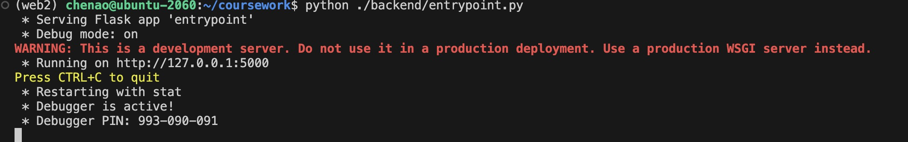
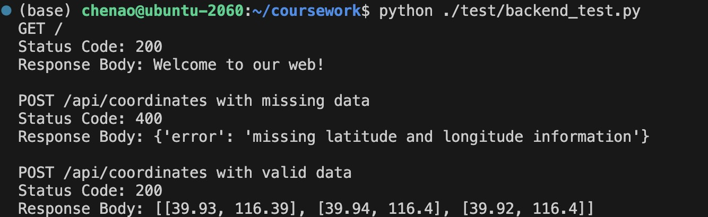

# Attraction_recommendation_service

## install:

```python
git clone https://github.com/hochen1/Attraction_recommendation_service.git arservice
cd arservice
conda create --name my_env python=3.8
conda activate my_env
pip install flask
```

## quick start:

### 1. Build the backend

```python
# make sure the local host 5000 is empty.
python ./backend/entrypoint.py
```

### successfully build the backend：

### 2. Run the test

```python
# run test script
python ./test/backend_test.py
```

### successfully test：
